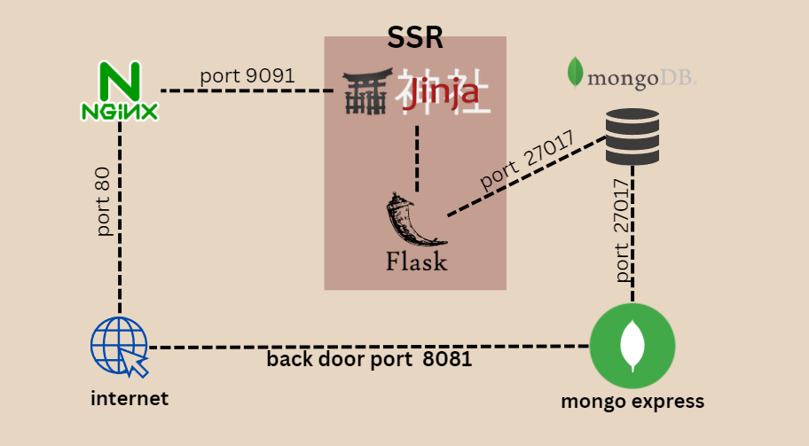

# รายละเอียดงาน
project จัดทำขึ้นเพื่อเป็นงานส่งในวิชา cloudcom puting
หัวข้อเรื่อง docker เเละการ interface หลายๆ container เข้าด้วยกัน \
\
จากนั้นก็ เอาลง AWS webservice deploy ลง ec2




จากรูปเเสดงให้เห็นถึง docker compose ที่ผมสร้าง \
\
# หลักการทำงาน
work dir
```
keep_note_full
├───flask
│   └───templates
├───nginx
└───volume
    └───db
        ├───.mongodb
        │   └───mongosh
        │       └───snippets
        ├───diagnostic.data
        └───journal
```
flask คือ api\
template คือตัวที่ jinja2 จะหยับไป render\
nginx คือ revers proxy\
volume คือ ข้อมูลใน database ซึ่งจะเชื่อมต่อกับ part ใน mongodb container \
compose yaml คือตัวที่ไว้ให้ docker มา compose up เเล้วสามารถใช้งานได้\

